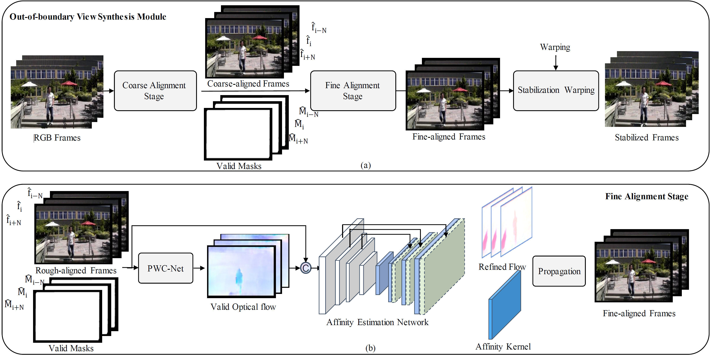

<h1 align="left">Out-of-boundary View Synthesis towards Full-frame Video Stabilization<a href="https://arxiv.org/abs/2108.09041">.svg" ></a>
</a> </h1> 

  <a href="#introduction">Introduction</a> |
  <a href="#update">Update</a> |
  <a href="#results-demo">Results Demo</a> |

## Introduction

This repository contains the code, models, test results for the paper <a href="https://arxiv.org/abs/2108.09041">Out-of-boundary View Synthesis towards Full-frame Video Stabilization</a>. It contains two stage for aligning the neighbor frames with current frame, i.e., coarse alignment and fine alignment. The coarse alignment part is from <a href="https://arxiv.org/pdf/2011.14574.pdf">DUT: Learning Video Stabilization by Simply Watching Unstable Videos</a>, whose code is publicly available at <a href="https://github.com/Annbless/DUTCode">DUTCode</a>. The fine alignment part is based on affinity estimation and propagation. The code will be publicly available at this repo.

## Update

> 2021.08.23 Initilize the codebase and we will upload the training and inference code as soon as possible.

## Results Demo

The results demo is available at <a href="https://drive.google.com/file/d/19sdQa4sVEyWub3q5TnVEdP5tOAbubx19/view?usp=sharing">Google drive</a>.